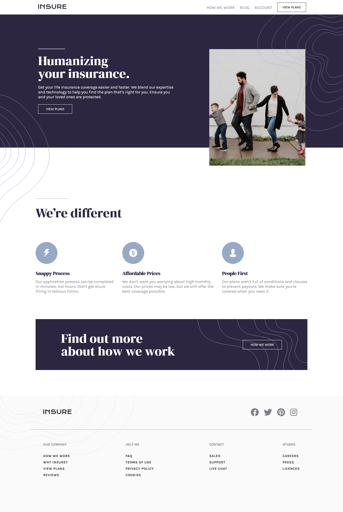

# Frontend Mentor - Insure landing page

## Table of contents

- [Overview](#overview)
  - [The challenge](#the-challenge)
  - [ Solution Screenshot](#screenshot)
  - [Links](#links)
- [My process](#my-process)
  - [Built with](#built-with)
  - [Useful resources](#useful-resources)
- [Author](#author)

## Overview

### The challenge

Users should be able to:

- View the optimal layout for the site depending on their device's screen size
- See hover states for all interactive elements on the page

### Screenshot

### Links

- Solution URL: [Insure Landing Page Solution](https://www.frontendmentor.io/challenges/insure-landing-page-uTU68JV8/hub/htmlcsssassflexjavscript-lG_WIQRXr)
- Live Site URL: [Live Site](https://insure-landing-site.netlify.app/)

## My process

### Built with

- Semantic HTML5 markup
- Sass (Syntactically awesome stylesheets)
- CSS custom properties
- Flexbox
- Mobile-first workflow

## Author

- Frontend Mentor - [@Pritam-Tirpude](https://www.frontendmentor.io/profile/Pritam-Tirpude)
- Twitter - [@ptirpude1991](https://twitter.com/ptirpude1991)
